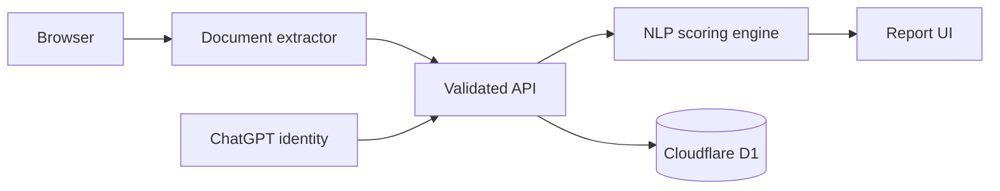

# Architecture

## System overview

## Data flow

1. The browser extracts text from PDF, DOCX, or TXT input.
2. Resume text and the job description are validated by the server endpoint.
3. The NLP engine detects normalized skills, frequent role keywords, experience signals, education, and project evidence.
4. Five subscores are combined using documented weights.
5. The API returns the report, cover-letter draft, and interview questions.
6. If the visitor is signed in, only report metadata is written to D1. Raw resume text is not stored.

## Security boundaries

- Authentication is owned by the hosting platform; the application never receives passwords.
- Authorization is enforced server-side using a stable authenticated user identifier.
- Every analysis payload is bounded and validated with Zod.
- Database reads are scoped to the authenticated user.
- SQL is generated through Drizzle ORM and executed using bound parameters.

## Explainability

The system uses a deterministic weighted model so the same inputs produce the same result. This makes the output testable and lets users see why the score changed.
